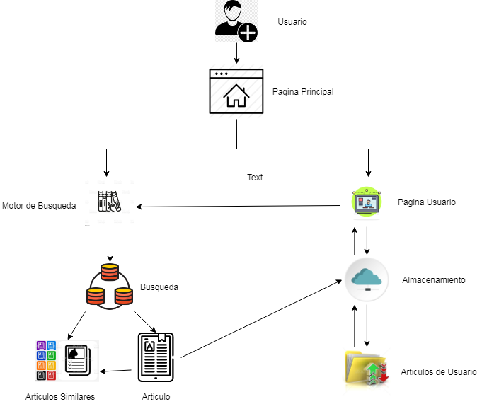

# Tipo de Sistema de información

## :trophy: C0.2 Reto en clase

Investigación sobre el tipo de sistema que involucra el caso de estudio a desarrollar

___

## Instrucciones

- Realizar una investigación sobre el tipo de sistema que se habrá de desarrollar, respondiendo a las preguntas que se plantean en la sesión de desarrollo.
- Puede apoyarse de la herramienta Draw.io para elaborar los diagramas o ilustraciones que se solicitan o considere necesario.
- Toda actividad o reto se deberá realizar utilizando el estilo **MarkDown con extension .md** y el entorno de desarrollo VSCode, debiendo ser elaborado como un documento **single page**, es decir si el documento cuanta con imágenes, enlaces o cualquier documento externo debe ser accedido desde etiquetas y enlaces.
- Es requisito que el archivo .md contenga una etiqueta del enlace al repositorio de su documento en Github, por ejemplo **Enlace a mi GitHub**
- Al concluir el reto el reto se deberá subir a github el archivo .md creado.
- Desde el archivo **.md** se debe exportar un archivo **.pdf** con la nomenclatura **C0.4_NombredelaActividad_NombreAlumno.pdf**, el cual deberá subirse a classroom dentro de su apartado correspondiente, para que sirva como evidencia de su entrega; siendo esta plataforma **oficial** aquí se recibirá la calificación de su actividad por individual.
- Considerando que el archivo .pdf, fue obtenido desde archivo .md, ambos deben ser idénticos y mostrar el mismo contenido.
- Su repositorio ademas de que debe contar con un archivo **readme**.md dentro de su directorio raíz, con la información como datos del estudiante, equipo de trabajo, materia, carrera, datos del asesor, e incluso logotipo o imágenes, debe tener un apartado de contenidos o indice, los cuales realmente son ligas o **enlaces a sus documentos .md**, _evite utilizar texto_ para indicar enlaces internos o externo.
- Se propone una estructura tal como esta indicada abajo, sin embargo puede utilizarse cualquier otra que le apoye para organizar su repositorio.

```
| readme.md
| | blog
| | | Cx.1_NombredelaActividad.md
| | | Ax.1_NombredelaActividad.md
| | diagrams
| | docs
| | html
| | img
| | pdf    
```
___

## :pencil2:  Desarrollo

1. Apoyado de la información mostrada por el asesor, realice una investigación, donde se pueda dar respuesta a los siguientes puntos:

  - Identifique a que tipo de sistema esta referido el caso de estudio y porque cae en esta categoría.
  
Caso de Uso Numero 3.-**Busqueda del Conocimiento**

Consideramos que el caso de uso que elejimos entra en la categoria de Software Educativo

Un **software educativo** es un programa con el fin de ser utilizados como medio didáctico, que pretende imitar la labor tutorial que realizan los profesores y presentan modelos de representación del conocimiento en consonancia con los procesos cognitivos que desarrollan los alumnos

  - Describa las características que debe tener el caso de estudio para cumplir con el tipo de sistema.
   
   **Finalidad Didáctica:**  Están elaborados con una intención pedagógica y en función de unos objetivos de enseñanza.

 **Uso del ordenador:** No requiere de mayor explicación. Sabemos que un software es para ser explorado a través de cualquier dispositivo .

 **Interacción:** Estimulan la participación del estudiante y el intercambio de información entre el estudiante y el dispositivo.

 **Individualización del trabajo:**  Le permiten al estudiante o usuario trabajar de forma individual, de acuerdo a su propio ritmo de aprendizaje.

**Facilidad de uso:**  Los conocimientos requeridos para el uso de estos programas es mínimo. El usuario o estudiante, sólo debe seguir las instrucciones que el programa le ofrece tanto para accesar a él como para navegar en él.

 
  - Una vez que se cuenta con los conceptos de los puntos anteriores, elabore una ilustración que explique el flujo de interacción del sistema y sus componentes que lo habrán de integrar (vistas gráficas, controladores, Base de datos,..) para el caso de estudio.
  
  
  - Explique en clase su investigación.
___

### :bomb: Rubrica

| Criterios     | Descripción                                                                                  | Puntaje |
| ------------- | -------------------------------------------------------------------------------------------- | ------- |
| Instrucciones | Se cumple con cada uno de los puntos indicados dentro del apartado Instrucciones?            | 20 |
| Desarrollo    | Se respondió a cada uno de los puntos solicitados dentro del desarrollo de la actividad?     | 80      |

   
:house: [Link a mi GitHub ](https://github.com/GuillermoSoria97/Analisis_Avanzado_de_Software)