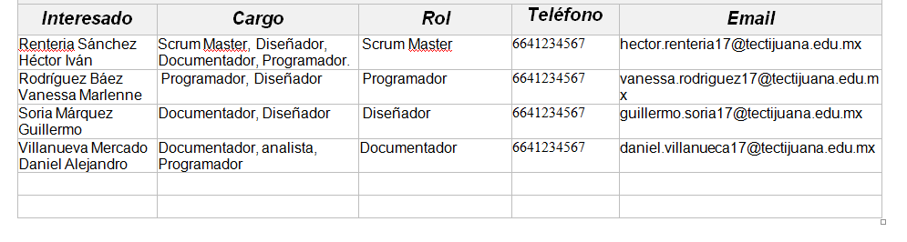
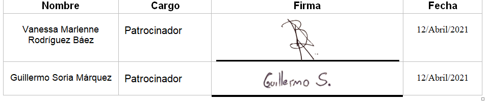

# Inicio del proyecto

## :trophy: C1.2 Reto en clase

Elaboracion del acta constitutiva del proyecto

### :blue_book: Instrucciones

- De acuerdo con la información presentada por el asesor referente al tema, y basado en el caso de estudio, realizar el acta constitutiva del proyecto basado en el ejemplo [documento acta constitución del proyecto](../pdf/C1.2_Ejemplo_ActaConstitución_delProyecto.pdf) indicada por el asesor
- Toda actividad o reto se deberá realizar utilizando el estilo **MarkDown con extension .md** y el entorno de desarrollo VSCode, debiendo ser elaborado como un documento **single page**, es decir si el documento cuanta con imágenes, enlaces o cualquier documento externo debe ser accedido desde etiquetas y enlaces.
- Es requisito que el archivo .md contenga una etiqueta del enlace al repositorio de su documento en Github, por ejemplo **Enlace a mi GitHub**
- Al concluir el reto el reto se deberá subir a github el archivo .md creado.
- Desde el archivo **.md** se debe exportar un archivo **.pdf** con la nomenclatura **C1.2_NombredelaActividad_NombreAlumno.pdf**, el cual deberá subirse a classroom dentro de su apartado correspondiente, para que sirva como evidencia de su entrega; siendo esta plataforma **oficial** aquí se recibirá la calificación de su actividad por individual.
- Considerando que el archivo .pdf, fue obtenido desde archivo .md, ambos deben ser idénticos y mostrar el mismo contenido.
- Su repositorio ademas de que debe contar con un archivo **readme**.md dentro de su directorio raíz, con la información como datos del estudiante, equipo de trabajo, materia, carrera, datos del asesor, e incluso logotipo o imágenes, debe tener un apartado de contenidos o indice, los cuales realmente son ligas o **enlaces a sus documentos .md**, _evite utilizar texto_ para indicar enlaces internos o externo.
- Se propone una estructura tal como esta indicada abajo, sin embargo puede utilizarse cualquier otra que le apoye para organizar su repositorio.

```
| readme.md
| | blog
| | | Cx.1_NombredelaActividad.md
| | | Ax.1_NombredelaActividad.md
| | diagrams
| | docs
| | html
| | img
| | pdf    
```
___

## :pencil2: Desarrollo

1. Elabore el documento que se anexa en las instrucciones referente al acta constitutiva al estilo markdown, dentro del entorno de visual studio code.
2. Redacte el acta constitutiva elaborada y registrada con los datos solicitados.


## Acta de Constitución de Proyecto

|**Empresa:**    | Mark Rock  | 
| ------------- | -------------------------------------------------------------------------------------------- | 
| **Nombre del proyecto:** |Búsqueda del conocimiento | 
| **Tipo de proyecto:** | Sistema de gestion de conocimiento (KMS) |
| **Patrocinador:** | Zerox|
| **Dueño del producto:** | The vid of knowledge|
| **Gerente del producto:** | Daniel Alejandro Villanueva  Mercado |
| **Scrum Master:** | Héctor Iván Renteria Sánchez|


|**Propósito del Docuemnto**   |
| ------------- |
|Este documento define la descripción general, los objetivos y los participantes del proyecto. Se relaciona principalmente con la autorización del inicio del proyecto. Asimismo este documento brinda una descripción de la situación actual, los requisitos de alto nivel, criterios de éxito, riegos y oportunidades.|

|**Propósito/ Justificación**   |   
| ------------- |
|Uno de los puntos más importantes que debe considerar la empresa Mark Rock es transmitir habilidades a los empleados, esto para fortalecer aspecto tales como: Trabajo en equipo, Flexibilidad, Autodidáctico, optimización de tiempo.  Esta Plataforma proporcionara el recurso vital para toda organización, y el buen manejo de esta puede significar la diferencia entre el éxito o el fracaso para todos los proyectos que se emprendan dentro de un organismo que busca el crecimiento y el éxito.|

|**Breve descripción del proyecto**   |   
| ------------- | 
|El proyecto consiste en desarrollar una plataforma en línea que se encuentre disponible las 24 hrs del día. La plataforma contara con un Inicio de Sesión para validar los datos del empleado, posteriormente contara con una página principal en la cual el usuario tendrá las opciones de realizar una búsqueda o dirigirse a su perfil personal.
Al momento de realizar una búsqueda no solo se mostrara el tópico de interés del usuario, se visualizaran tópicos similares al tema seleccionado, esto con el objetivo de enriquecer la información. El usuario podrá guardar el tópico que más le interesa y lo podrá volver a consultar dentro de su perfil con la opción de descarga.|

|**Alcance preliminar del proyecto**   |   
| ------------- | 
|•	Dominar las herramientas a utilizar|
|•	Diseño Amigable|
|•	Insertar Tópicos en el motor de búsquedas|
|•	Consultar tópicos|
|•	Descargar tópicos|

|**Resultados esperados del proyecto / Beneficios**   |   
| ------------- | 
| •	Fomentar el conocimiento también es más flexible y tiene más capacidad para adaptarse a situaciones cambiantes. |
|•	Las habilidades adquiridas también permiten hacer una gestión más eficiente de los procesos, de modo que se trabaja de forma más productiva y se obtienen mejores resultados.|
|•	Cuando se puede acceder fácilmente a la información también es más sencillo tomar decisiones, así que se acelera este trámite. La ventaja que esto supone tanto para el trabajo interno como para la atención al cliente es evidente.|
| •	La búsqueda del conocimiento también fomenta el trabajo en equipo. Una plantilla integrada puede llegar a mejores ideas que repercuten directamente en el funcionamiento de la empresa.|
|**Requisitos de alto nivel del proyecto:**   |  | 
| ------------- | -------------------------------------------------------------------------------------------- | 

|**Requisito** | **Criterio de Éxito** |
|Disponibilidad en todo momento.|La plataforma debe funcionar en todo momento.|
|Catalogo de tópicos relacionados.| Al momento de realizar una búsqueda la plataforma debe proporcionar un apartado donde se encuentren los tópicos similares al tema seleccionado.|
|Consultas de tópicos registrados anteriormente.|La plataforma contara con un perfil de usuario en el cual se almacenen los tópicos registrados y/o guardados por el usuario para que puedan ser consultados en cualquier momento .|

|**Hitos**   |   
| ------------- | 
|En base a la información disponible y al alcance definido, se estima una dedicación de esfuerzo de 57 días|
|En base a nuestra experiencia y la disponibilidad y agenda del personal del cliente, se estima una duración total del proyecto de 11-13 semanas|
|Para asegurar el cumplimiento de los objetivos del proyecto, éste se abordará mediante 7 fases, presentadas a continuación.|
|
| •	Los principales hitos del proyecto se encuentran resumidos en la tabla siguiente: 
|

|**Riesgos**   |   
| ------------- | 
| •	Mala estimación de tiempos
•	Falta de compromiso de algún miembro del equipo de desarrollo
•	Motivación débil
•	Incompatibilidad de la herramientas seleccionadas
•	Diseño ineficiente de la Interfaz
•	Incompatibilidad con la Base de datos
•	Plataforma no amigable para el usuario 
•	Mala calidad de la plataforma
•	La estimación y pronósticos de Costos son inexactos 

|**Costo Preliminar Estimado / Presupuesto**   |   
| ------------- | 
|•	Planeación………………………………………………………..$6,000|
|•	Análisis de los requerimientos………………………………….$4,000|
|•	Diseño de la aplicación………………………………………….$12,000|
|•	Desarrollo del software………………………………………….$30,000|
•	Pruebas y corrección…………………………………………….$12,000|
|•	Implementación…………………………………………………..$4,500|
|•	Total……………………………………………………………….$68,500|

|**Interesados en el proyecto**   | 
| ------------- | 
| |

|**Supuestos**   | 
| ------------- | 
|•	Participación del departamento de diseño, programación y documentación.
 •	Aprobación del cliente referente al diseño


|**Restricciones**   | 
| ------------- |
|•	Terminar el Proyecto en el tiempo establecido
•	Verificar la información para poder subir el tópico
•	Computadora y/o Móvil para acceder a la Plataforma
•	Tener un Buscador


|**Autorización de proyecto**   | 
| ------------- | 
| |
___

### :bomb: Rubrica

| Criterios     | Descripción                                                                                  | Puntaje |
| ------------- | -------------------------------------------------------------------------------------------- | ------- |
| Instrucciones | Se cumple con cada uno de los puntos indicados dentro del apartado Instrucciones?            | 20 |
| Desarrollo    | Se respondió a cada uno de los puntos solicitados dentro del desarrollo de la actividad?     | 80      |


:house: [Link a mi GitHub ](https://github.com/GuillermoSoria97/Analisis_Avanzado_de_Software)