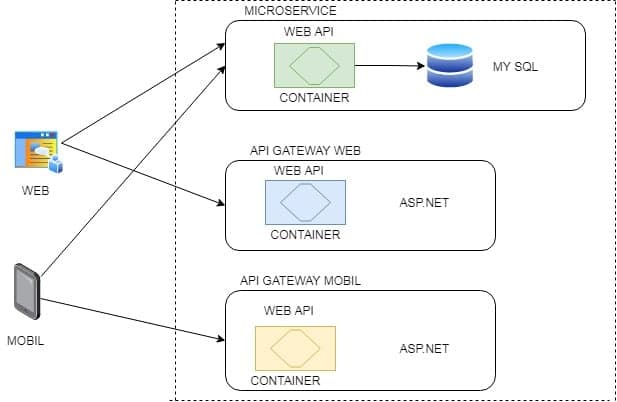
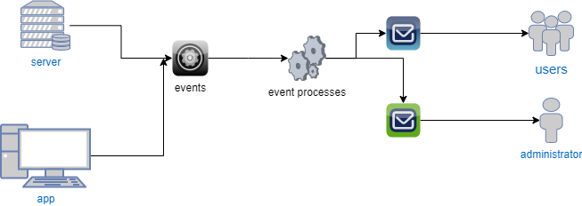

## Introduction

## :trophy: A2.3 Learning Activity

- Software Architecture Patterns

### :blue_book: Instructions

- Based on the documentation of software architecture styles and patterns, elaborate the system architecture for the case study. 
- Any activity or challenge must be done using the **MarkDown style with extension .md** and the VSCode development environment. VSCode development environment, or you can use a platform such as **Notion**, and it must be elaborated as a **single page** document as a **single page** document, that is to say, if the document has images, links or any other external document, it must be external document must be accessed from tags and links, and must be named with the nomenclature **A2.3_ActivityName_StudentName.pdf.**.
- It is required that the .MD contains a link tag to the repository of your document in GITHUB, e.g. **Link to my GitHub**.for example **Link to my GitHub** and at the end of the challenge it must be uploaded to github.
- From the **.md** file, export a **.pdf** file that must be uploaded to the classroom in its corresponding section as evidence of its delivery, since the **official** platform is where the grade for your activity will be received. 
- Considering that the .PDF file, which was obtained from the .MD file, both must be identical.
- Your repository must also have a **readme**.md file in its root directory, with the information such as student data, work team, subject, career, advisor data, and even the information such as student's data, work team, subject, career, advisor's data, and even logo or images. logo or images, it must have a contents section or index, which are actually links or links to your .md documents.**links to your .md documents**, _avoid using text_ to indicate internal or external links.
- The proposed structure is as shown below, but you can use any other structure that will help you to organize your repository. 

```
| readme.md
| | blog
| | | Cx.1_NameofActivity.md
| | | Ax.1_NameofActivity.md
| | diagrams
| | docs
| | html
| | img
| | pdf    
```
___

### :pencil2: Development

1. Consider applying to the case study the following architectural patterns
   
   - [ ] Client-server architecture pattern
   - [ ] Layered Architecture Pattern
   - [ ] Architecture pattern Model view controller
   - [ ] Micro-services oriented architecture pattern
   - [ ] Architectural pattern Piping and filters
   - [ ] Event-driven architecture pattern
   - [ ] Repository or blackboard architecture pattern
   - [ ] Publisher/subscriber architecture pattern
   - [ ] Master-slave architecture pattern
   - [ ] Point-to-point architectural pattern

2. Take as a basis the architectural views as well as the UML diagrams elaborated, to apply the pattern that you consider the most appropriate for each of the following scenarios.that you consider the most appropriate for each of the following scenarios.

- 2.1 Considering that it is desired to **maintain and scale the system**, it is sought to develop the application through the decomposition of small independent and isolated services, which consume a through the decomposition of small independent and isolated services, which consume an external interface to communicate to a database server.

***Microserver pattern***

- 2.2 Since **confidentiality and security** are attributes or requirements for the case study, we seek to structure each of the components to be programmed in groups of sub-tasks, where each of these sub-tasks must communicate with an intermediate layer and this to another of these sub-tasks must communicate with an intermediate layer and this one with a higher layer.
- 2.3 Looking for the **availability** of the system, it is proposed to install two service servers, where requests to a third server where the database would be stored.

***Blackboard Pattern***

- 2.4 Identifying that data **integrity** is a requirement, it is proposed to replicate and synchronize the database stored within the main server to another one, considering the main as master and the secondary as slave. 
- 2.5 Considering that the client requested that every time a failure occurs, **alarms** must be provided to the different users, regardless of their location, it is alarms to the different users regardless of where they are located, it is noted that a service provider should be contracted to trigger the alarms to reach the users. service provider should be contracted to trigger the alarms so that they reach the required users required.

***Event-Driven***


## Conclusions 

*  **Renteria Sanchez Hector Ivan:** 

*  **Rodríguez Báez Vanessa Marlenne:** In this activity we learned about architectural patterns.
How to handle them in our project and how to combine each pattern in the selected points, our dilemma was to know which patterns to put in each point since many were similar and how to combine them in the diagram to understand the operation of the program, I had never seen or read about these diagrams, with this activity I learned something new that I will use in future projects


*  **Soria Márquez Guillermo:** When I started this activity I thought it was relatively simple, because the instructions made us base it on past diagrams and adapt them to the patterns selected for each point. It was difficult to adapt it because I was not sure how to do it, after seeing several examples on the internet and relying on the presentation of patterns that was provided to us, I made the diagram of the point that corresponded to me.  Other than that I did not have any other problems in this practice. 


*  **Villanueva Mercado Daniel Alejandro:** This activity despite being partly simple has its own drawbacks. Such as having to analyze each of the diagrams for each of the specific cases raised in the activity. It could be said that the most difficult part of this activity was to make the diagrams that corresponded to each of the points, but more than anything having to adapt each of these diagrams to the case study was what was really complicated. It was not the elaboration of the diagrams, but rather the expression of what we thought was happening in each one of these points, so that it could be understood as well as possible with the diagram.
___   
### :bomb: Rubric

| Criteria     | Description                                                                                  | Score |
| ------------- | -------------------------------------------------------------------------------------------- | ------- |
| Instrucciones |Each of the points indicated in the instructions section is complied with.?            | 10      |  | 5 |
| Development    | Each of the points requested in the development of the activity was answered?     | 60      |
| Demonstration  | The student introduces himself during the explanation of the functionality of the activity.?            | 20      |
| Conclusions  | A personal opinion of the activity is included for each team member.? | 10      |

:house: [Link Renteria Sanchez Hector Ivan](https://github.com/IvanRenteria/Analisis-Avanzado-de-Software)

:house: [Link Rodríguez Báez Vanessa Marlenne](https://github.com/vanessamRodriguez/Analisis-Avanzado-de-Software)

:house: [Link Soria Márquez Guillermo](https://github.com/GuillermoSoria97/Analisis_Avanzado_de_Software)

:house: [Link Villanueva Mercado Daniel Alejandro](https://github.com/Dany305/Analisis-Avanzado-de-Software)